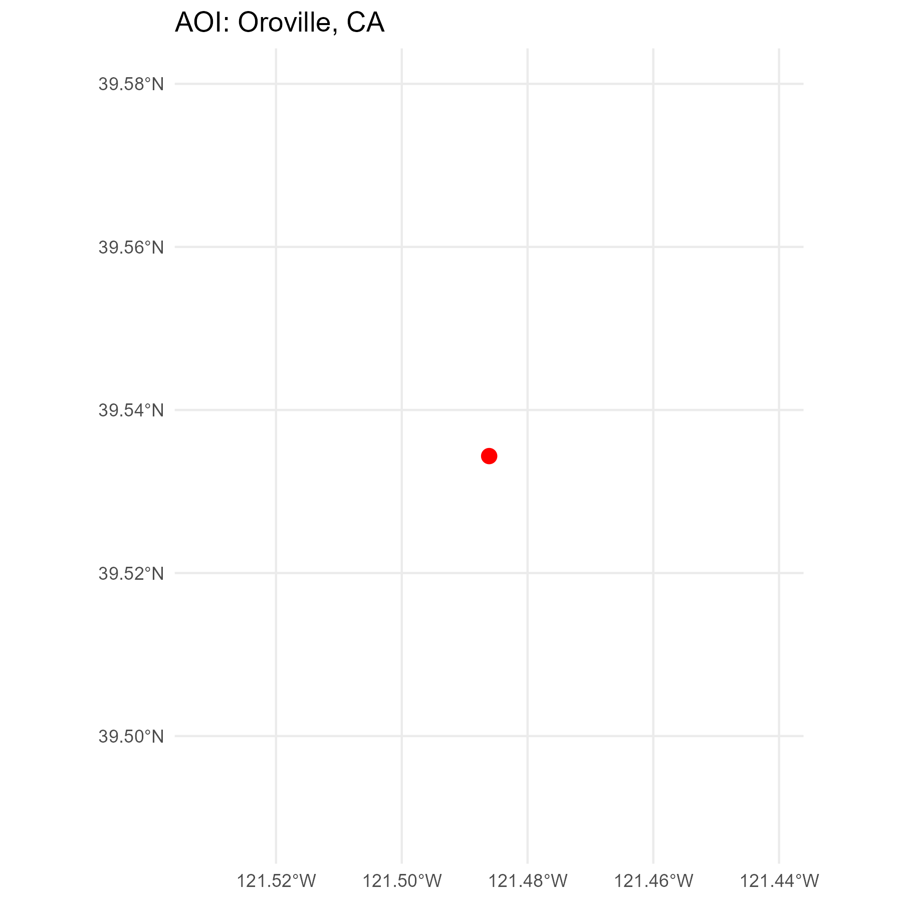
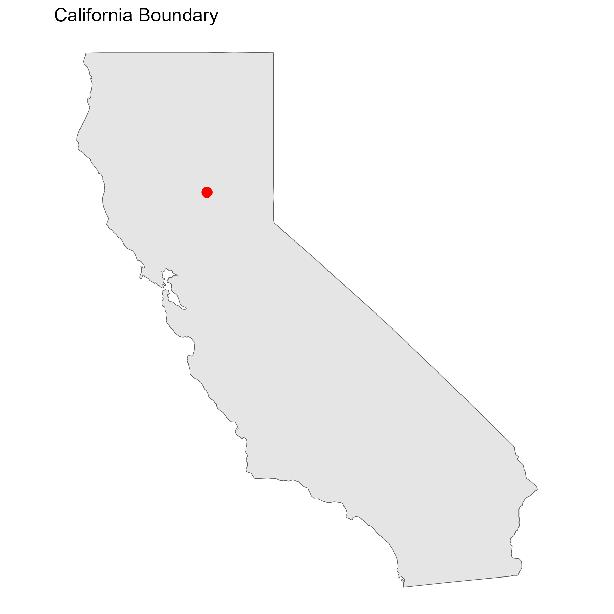
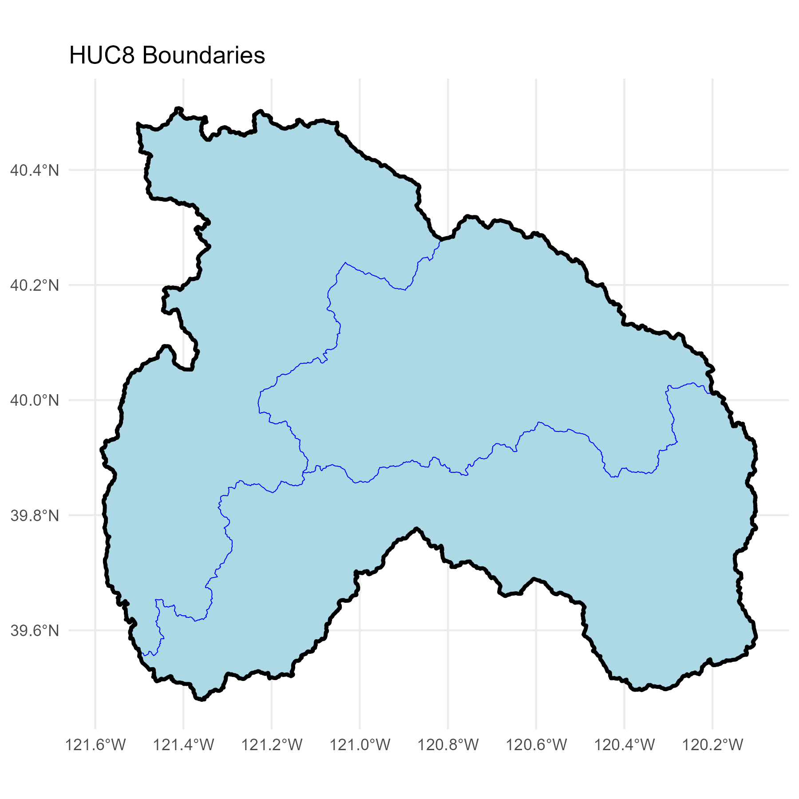
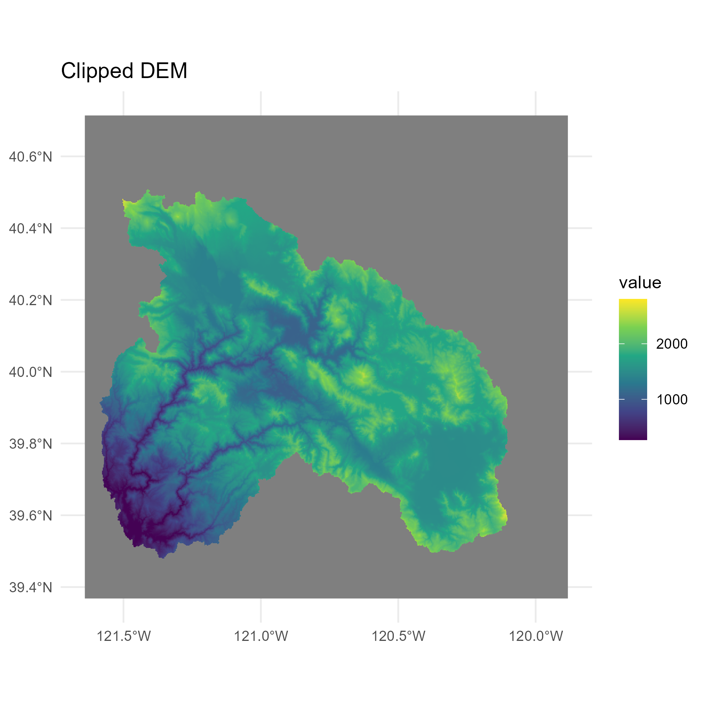
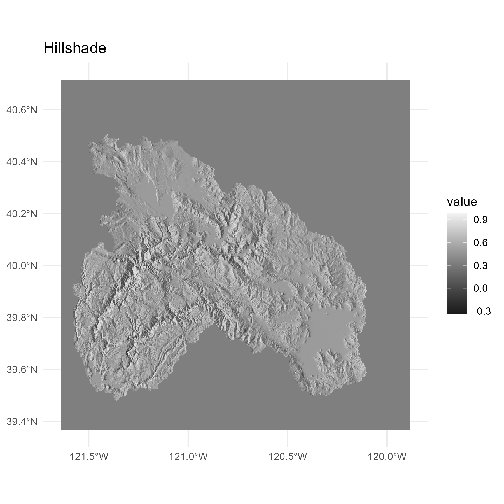
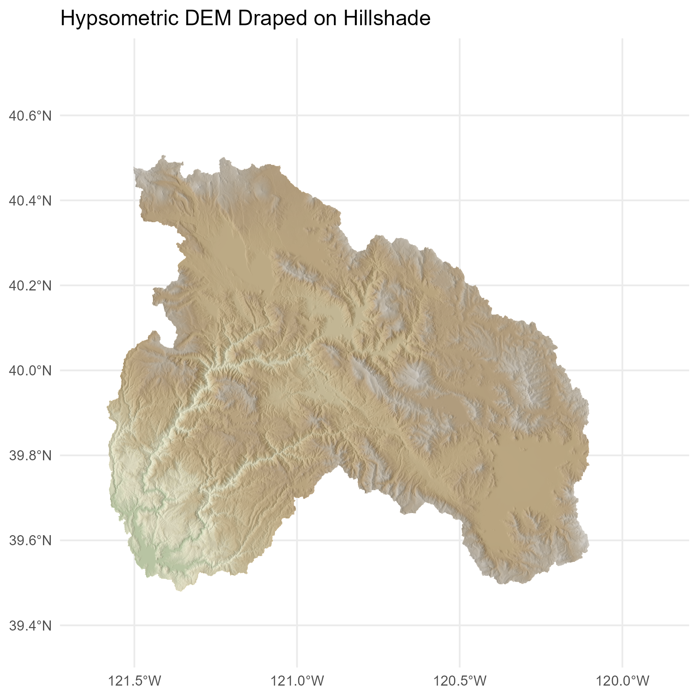
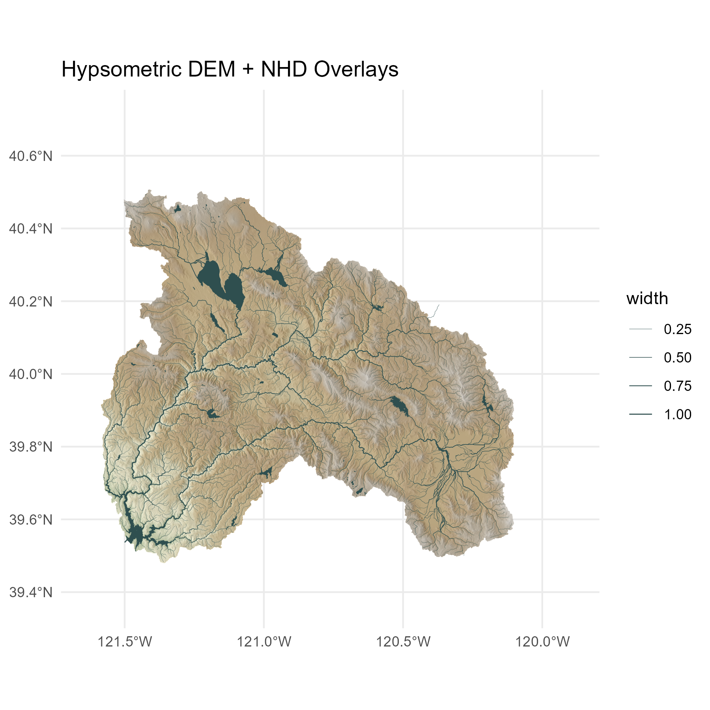
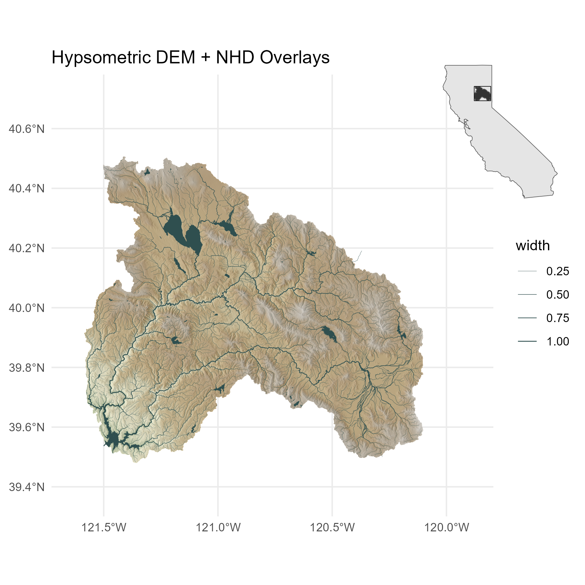

# 🌄 Draped Hypsometric DEM Workflow  
*A step‑by‑step geospatial visualization pipeline in R*

This tutorial demonstrates how to generate a **draped hypsometric DEM** clipped to a user‑defined HUC, with **NHD waterbodies** and **flowlines** overlaid.  
All intermediate images shown below are produced automatically by running `make_readme_images.R`.

---

# 📦 Required Libraries

```{r}
library(tidyverse)
library(sf)
library(nhdplusTools)
library(elevatr)
library(hillshader)
library(raster)
library(terra)
library(tidyterra)
library(ggspatial)
library(ggpattern)
library(ggnewscale)
library(ggrepel)
library(scales)
library(cowplot)
```

---

# 1️⃣ Define Area of Interest (Oroville, CA)

```{r}
oroville_df <- data.frame(Y = 39.534344, X = -121.486103)
oroville_sf <- st_as_sf(oroville_df, coords = c("X", "Y"), crs = 4326)
```



---

# 2️⃣ Load California Boundary (for inset map)

```{r}
us_states <- map_data("state")
cali <- us_states[us_states$region == "california",]

polygon <- st_polygon(list(as.matrix(cali[,c("long", "lat")])))
cali_sf <- st_sf(id = "california", geometry = st_sfc(polygon), crs = 4326)
```



---

# 3️⃣ Retrieve HUC Boundaries

```{r}
huc8 <- nhdplusTools::get_huc(
  id = c("18020121", "18020122", "18020123"),
  type = "huc08"
) %>% st_transform(4326)

feather_dissolve <- huc8 %>%
  summarise(geometry = st_union(geometry)) %>%
  st_as_sf()

feather_bbox <- st_bbox(feather_dissolve)
feather_bbox_sf <- st_as_sfc(feather_bbox)
```



---

# 4️⃣ Load NHD Flowlines & Waterbodies

```{r}
nhd_flow <- nhdplusTools::get_nhdplus(
  AOI = feather_dissolve,
  realization = "flowline"
) %>% st_transform(4326)

nhd_flow <- merge(
  nhd_flow,
  data.frame(streamorde = 1:6, width = rev(c(1, .8, .6, .4, .2, .1)))
)

nhd_wb <- nhdplusTools::get_waterbodies(AOI = feather_dissolve) %>%
  st_transform(4326)
```


---

# 5️⃣ Download & Clip Elevation Data

```{r}
elevation_data <- get_elev_raster(
  locations = feather_dissolve,
  z = 10,
  prj = st_crs(4326)$proj4string
)

elevation_data <- mask(elevation_data, feather_dissolve)
r <- rast(elevation_data)
```



---

# 6️⃣ Generate Hillshade

```{r}
slope  <- terrain(r, "slope", unit = "radians")
aspect <- terrain(r, "aspect", unit = "radians")
hill   <- shade(slope, aspect, 30, 270)
names(hill) <- "shades"
```



---

# 7️⃣ Apply Hypsometric Tint & Draping  
*(Your exact code preserved)*

```{r}
pal_greys <- hcl.colors(1000, "Grays")

index <- hill %>%
  mutate(index_col = rescale(shades, to = c(1, length(pal_greys)))) %>%
  mutate(index_col = round(index_col)) %>%
  pull(index_col)

vector_cols <- pal_greys[index]

map_hypso <- ggplot() +
  geom_spatraster(data = hill, fill = vector_cols, maxcell = Inf, alpha = 1) +
  geom_spatraster(data = r, maxcell = Inf, show.legend = FALSE) +
  scale_fill_hypso_tint_c(
    limits = c(0, 2730),
    palette = "wiki-2.0_hypso",
    alpha = 0.6,
    labels = label_comma(),
    breaks = c(seq(0, 1000, 200),
               seq(1100, 2500, 100),
               2600)
  ) +
  theme_minimal() +
  labs(title = "Hypsometric DEM Draped on Hillshade")
```



---

# 8️⃣ Add NHD Water Features

```{r}
map_hypso_nhd <- map_hypso +
  geom_sf(data = nhd_wb[nhd_wb$ftype %in% "LakePond",], fill = "darkslategrey", color = NA) +
  geom_sf(data = nhd_flow, aes(linewidth = width), color = "darkslategrey") +
  scale_linewidth(range = c(0.05, .3)) +
  labs(title = "Hypsometric DEM + NHD Overlays")
```



---

# 9️⃣ Add Inset Map & Compose Final Figure

```{r}
inset <- ggplot() +
  geom_sf(data = cali_sf, fill = "gray90") +
  geom_sf(data = feather_dissolve, fill = "grey20") +
  geom_sf(data = feather_bbox_sf, fill = NA, color = "black") +
  theme_void()

final_map <- ggdraw() +
  draw_plot(map_hypso_nhd) +
  draw_plot(inset, x = .73, y = .65, width = 0.25, height = 0.25)

final_map
```



---

# 🎉 Final Notes

- This README is written in **Quarto‑compatible Markdown**.  
- You can paste it directly into `README.md` or save it as `README.qmd`.  
- Running `make_readme_images.R` will generate all images automatically.  
- The workflow is fully reproducible and uses only open data sources.

